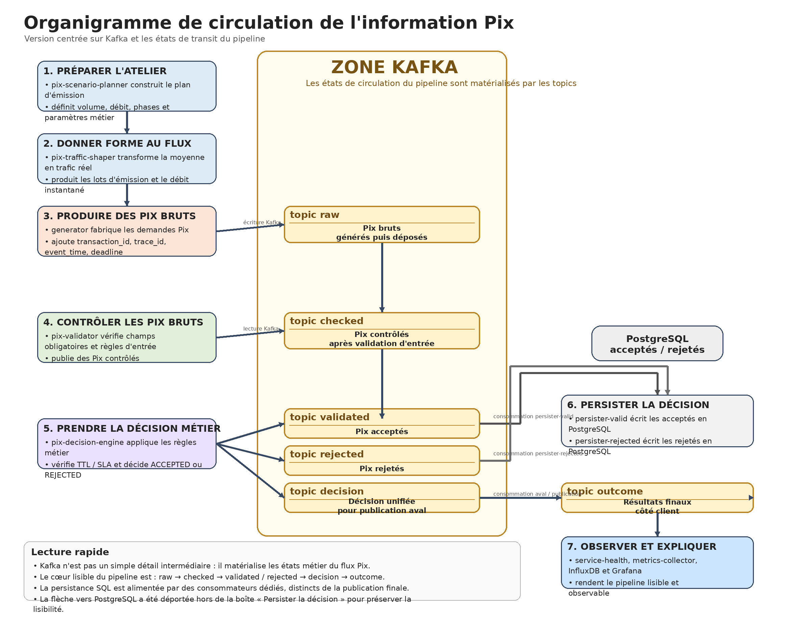

# Interactions Entre Les Conteneurs

Cette note montre comment circule maintenant l'information dans `Simul-Pix`.

L'objectif est double :

- identifier le rôle de chaque conteneur ;
- montrer la chaîne pédagogique visible `Pix émis -> Pix contrôlés -> Décisions publiées -> Réponses finales`.

Pour la limite actuelle sur la sémantique `SUB exactly once`, voir aussi [kafka-sub-exactly-once-limit.md](kafka-sub-exactly-once-limit.md).
Pour une architecture cible plus robuste, voir aussi [kafka-inbox-outbox-design.md](kafka-inbox-outbox-design.md).

## Vue d'ensemble

Le point clé de l'architecture actuelle est le suivant :

- `generator` produit des demandes de paiement Pix ;
- `pix-validator` contrôle l'entrée et publie des `Pix contrôlés` ;
- `pix-decision-engine` transforme ce flux contrôlé en `Décisions publiées` ;
- `pix-outcome-publisher` matérialise les `Réponses finales` côté client ;
- les persisters rendent ces décisions durables dans PostgreSQL ;
- `service-health`, `metrics-collector`, `InfluxDB` et `Grafana` rendent l'ensemble observable.

La chaîne pédagogique active repose maintenant uniquement sur `pix-validator`, `pix-decision-engine` et `pix-outcome-publisher`.

## Organigramme Métier Des Données

L'image ci-dessous est désormais la vue de référence.

Une version illustrée du même organigramme est aussi disponible ci-dessous :



### Comment Lire Le Schéma

Le schéma se lit de gauche à droite.

- à gauche :
  préparation de l'atelier et génération du flux ;
- au centre :
  `ZONE KAFKA`, qui matérialise les états de transit des Pix ;
- à droite :
  persistance PostgreSQL puis publication du résultat final ;
- en bas à droite :
  la couche d'observabilité.

### Ce Qu'Il Faut Retenir

- `pix-scenario-planner` prépare l'atelier ;
- `pix-traffic-shaper` décide de la forme réelle du trafic ;
- `generator` produit les `Pix émis` et les dépose dans Kafka ;
- `pix-validator` transforme les `Pix émis` en `Pix contrôlés` ;
- `pix-decision-engine` prend la décision métier et produit :
  - `validated`
  - `rejected`
  - `decision`
- `pix-outcome-publisher` transforme `decision` en `outcome` ;
- `persister-valid` et `persister-rejected` rendent la décision durable dans PostgreSQL ;
- `service-health`, `metrics-collector`, `InfluxDB` et `Grafana` rendent le pipeline lisible.

## Table De Lecture Rapide

| Étape | Données en entrée | Traitement / décision | Données en sortie |
| --- | --- | --- | --- |
| `pix-scenario-planner` | paramètres d'atelier | construit le plan d'émission | plan d'atelier |
| `pix-traffic-shaper` | plan d'atelier | calcule le trafic réel | lots d'émission |
| `generator` | lots d'émission | fabrique et publie les Pix | `raw` = Pix émis |
| `pix-validator` | Pix émis + retry | contrôle d'entrée | `checked` = Pix contrôlés |
| `pix-decision-engine` | Pix contrôlés | accepte ou rejette | `validated`, `rejected`, `decision` |
| `pix-outcome-publisher` | Décisions publiées | publie le résultat final | `outcome` = Réponses finales |
| `persister-valid` | Pix acceptés | écrit en base | lignes PostgreSQL acceptées |
| `persister-rejected` | Pix rejetés | écrit en base | lignes PostgreSQL rejetées |
| `service-health` / `metrics-collector` | états des services, Kafka, base | agrège et explique | météo et dashboards |

## Parcours d'un Pix accepté

```text
    [1] generator
        |
        | produit une transaction Pix brute
        | avec event_time, decision_deadline, scenario_type
        v
    [2] topic raw
        |
        | transport Kafka
        v
    [3] pix-validator
        |
        | contrôles d'entrée OK
        | publication dans checked
        v
    [4] topic checked
        |
        | transport Kafka
        v
    [5] pix-decision-engine
        |
        | contrôles métier OK
        | decision_status = ACCEPTED
        | decision_reason_code = ACCEPTED
        v
    [6] topic validated ----------------------+
        |                                     |
        |                                     v
        |                              [7] persister-valid
        |                                     |
        |                                     | écriture durable SQL
        |                                     v
        |                              [8] postgres
        |
        +------------------------------> [9] topic decision
                                              |
                                              | décision métier unifiée
                                              v
                                      [10] pix-outcome-publisher
                                              |
                                              | décision finale client
                                              v
                                      [11] topic outcome
                                              |
                                              v
                                      [12] service-health / Grafana
```

Lecture :

- le Pix brut est créé par le `generator` ;
- l'entrée contrôlée est créée par `pix-validator` ;
- la décision d'acceptation est créée par `pix-decision-engine` ;
- la décision finale côté client est matérialisée par `pix-outcome-publisher` ;
- la durabilité est assurée ensuite par `persister-valid` et PostgreSQL.

## Parcours d'un Pix rejeté sur TTL

```text
    [1] generator
        |
        | produit une transaction Pix brute
        | avec un TTL et une decision_deadline
        v
    [2] topic raw
        |
        | backlog / ralentissement / retard de traitement
        v
    [3] pix-validator
        |
        | contrôles d'entrée OK
        | publication dans checked
        v
    [4] topic checked
        |
        | traitement tardif
        v
    [5] pix-decision-engine
        |
        | decision_deadline dépassée
        | erreur technique = processing_timeout
        | decision_status = REJECTED
        | decision_reason_code = PROCESSING_TIMEOUT
        v
    [6] topic rejected -----------------------+
        |                                     |
        |                                     v
        |                              [7] persister-rejected
        |                                     |
        |                                     | écriture durable SQL
        |                                     v
        |                              [8] postgres
        |
        +------------------------------> [9] topic decision
                                              |
                                              | décision métier unifiée
                                              v
                                      [10] pix-outcome-publisher
                                              |
                                              | décision finale client
                                              v
                                      [11] topic outcome
                                              |
                                              v
                                      [12] service-health / Grafana
```

Lecture :

- le rejet TTL n'est pas décidé par le `generator` ;
- il est décidé par `pix-decision-engine` quand la fenêtre SLA est dépassée ;
- il est ensuite persisté et rendu observable comme n'importe quelle autre décision.

## Autres formes de rejet de Pix

Oui. Le dépôt implémente d'autres formes de rejet que le seul rejet TTL.

### Rejet technique de délai

Ce rejet est produit quand `pix-decision-engine` traite le message après sa `decision_deadline`.

Code client :

- `PROCESSING_TIMEOUT`

Motif technique interne :

- `processing_timeout`

### Rejets métier simples

Le moteur de décision peut aussi rejeter un Pix pour des incohérences métier ou de structure.

Motifs techniques actuellement implémentés :

- `invalid_amount`
- `missing_required_field`
- `same_account`
- `invalid_initial_status`
- `emitter_tax_id_mismatch`
- `beneficiary_tax_id_mismatch`

### Rejet technique de secours

Un rejet technique générique peut aussi apparaître si une erreur inattendue survient pendant la prise de décision.

## Résumé pédagogique

La lecture utile de l'architecture actuelle est la suivante :

- `generator` montre la création de la demande ;
- `pix-validator` montre l'entrée contrôlée ;
- `pix-decision-engine` montre le cœur métier ;
- `pix-outcome-publisher` montre la matérialisation finale ;
- les persisters montrent la durabilité ;
- `service-health` et Grafana rendent les étapes visibles.

Cette séparation est volontairement plus explicite qu'efficace : elle sert d'abord la compréhension pédagogique du pipeline.
